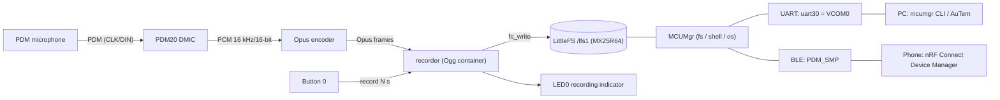
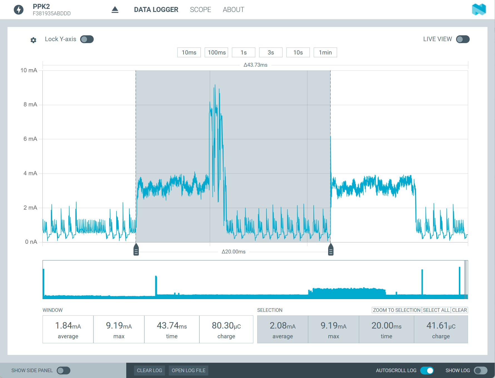

# nrf54l_pdm_opus_recorder

PDM recording and power-evaluation demo for the nRF54L15 / nRF54LM20,
built on the Zephyr DMIC API (NCS v3.4.0).

## 1. Features and usage

Continuous PDM capture → real-time Opus compression → one button press
saves the next few seconds as a `.opus` file (LittleFS on external flash,
LED indicates recording) → files are transferred to a PC or phone over
SMP (MCUMgr) via UART or BLE.



### How to operate

1. Capture and encoding start automatically at boot; nothing is stored.
2. **Press Button 0**: the next `CONFIG_PDM_DEMO_REC_SECONDS` (default 10)
   seconds are written to `/lfs1/rec_XXXX.opus`; **LED0 is on** while
   recording and turns off when the file is saved. Further presses during
   a recording are ignored.
3. Retrieve files:
   - **PC over UART**: MCUMgr is on VCOM0 (usually the first COM port on
     Windows, 115200 8N1); logs are on VCOM1 (second COM port).

     ```powershell
     mcumgr --conntype serial --connstring dev=COM3,baud=115200 shell exec fs ls /lfs1
     mcumgr --conntype serial --connstring dev=COM3,baud=115200 fs download /lfs1/rec_0000.opus rec_0000.opus
     ```

   - **Phone over BLE**: connect to `PDM_SMP` (no pairing). The Android
     nRF Connect Device Manager app has a Shell tab — run `fs ls /lfs1`
     directly.
   - **iOS**: Device Manager has no Shell tab and SMP has no "list
     directory" command, so download the fixed path `/lfs1/index.txt`
     first (refreshed at boot and after every recording, lists all files
     with sizes), then download by full path. The in-app Preview does not
     handle `.opus`; open downloaded files in a player like VLC.

Debug firmware prints statistics every 100 blocks on the log port
(average frame bytes, max encode time, error count).

## 2. Hardware

- **Boards**: nRF54L15DK (`nrf54l15dk/nrf54l15/cpuapp`) or nRF54LM20DK
  (`nrf54lm20dk/nrf54lm20b/cpuapp`); ready-made files under `boards/`
- **NCS**: v3.4.0
- **PDM peripheral**: PDM20, ratio 50, 800 kHz PDM clock, `H0H1` drive
- **External flash**: on-board MX25R64 (spi00 @ 32 MHz), whole 8 MB
  mounted as LittleFS at `/lfs1`
- **UARTs**: VCOM0 = uart30 = MCUMgr; VCOM1 = uart20 = logging

### PDM wiring

| DK | PDM microphone |
|---|---|
| P1.12 | CLK |
| P1.11 | DIN / DATA |
| GND | GND |
| External supply | VDD |

For stereo, two microphones share CLK/DIN with their L/R pins strapped to
opposite channels. For mono, connect one microphone and select the
matching mono configuration. Do not use P1.11/P1.12 together with an
nRF7002 shield. The microphone is powered externally; its supply current
is not part of the SoC measurement.

## 3. Clone and build

The Opus codec is a git submodule (`lib/opus`, upstream xiph/opus v1.5.2);
initialize it after cloning:

```powershell
git submodule update --init
```

To upgrade Opus: `cd lib/opus; git fetch --tags; git checkout v1.x.y`,
then `git add lib/opus`. The Zephyr module glue lives in `modules/opus/`
and usually needs no changes for minor upstream upgrades.

### Debug build (default: stereo + Opus + MCUMgr)

```powershell
nrfutil sdk-manager toolchain env --ncs-version=v3.4.0 --as-script powershell | Out-String | Invoke-Expression
$env:ZEPHYR_BASE = (Resolve-Path "D:\ncs\v3.4.0\zephyr").Path

west build -p always -b nrf54lm20dk/nrf54lm20b/cpuapp -d build . --no-sysbuild
west flash -d build
```

For the nRF54L15DK use board target `nrf54l15dk/nrf54l15/cpuapp`.

Check the artifacts after building: `build/zephyr/zephyr.hex`,
`zephyr.dts`, `.config`.

## 4. Release builds and power measurement

Release builds use a standalone base configuration `prj_release.conf`
(via `-DFILE_SUFFIX=release`, which fully replaces `prj.conf` instead of
overlaying it). Logging, serial, and the console are disabled. Behavior:
**continuous PDM capture + Opus encoding + button recording + SMP over
BLE** (the UART SMP transport goes away with the serial port; BLE
transfer and recording are unaffected). Intended for power measurement.

```powershell
# Release stereo (default)
west build -p always -b nrf54lm20dk/nrf54lm20b/cpuapp -d build_release . --no-sysbuild `
    -- "-DFILE_SUFFIX=release"

# Release mono (left; use -DCONFIG_PDM_DEMO_MONO_RIGHT=y for right)
west build -p always -b nrf54lm20dk/nrf54lm20b/cpuapp -d build_release_mono . --no-sysbuild `
    -- "-DFILE_SUFFIX=release" "-DCONFIG_PDM_DEMO_MONO_LEFT=y"

# Plain PDM power baseline (standalone base config prj_test_only.conf:
# no encoding, no storage, no SMP/BLE)
west build -p always -b nrf54lm20dk/nrf54lm20b/cpuapp -d build_test_only . --no-sysbuild `
    -- "-DFILE_SUFFIX=test_only"
```

Measurement procedure:

1. Prepare the DK SoC current-measurement path and PPK2 according to the
   DK hardware guide.
2. Flash the image and reset; PDM capture starts automatically.
3. Wait for startup transients to settle, then record the average current.
4. Keep channel mode, PDM clock, block duration, and supply voltage
   unchanged when comparing measurements.

Runtime device PM is enabled by default (`CONFIG_PM_DEVICE_RUNTIME`), so
idle peripherals suspend themselves. During recording the firmware pins
the flash and its SPI bus active with `pm_device_runtime_get()` so each
write does not pay a wake-up penalty.

### Power data



<!-- TODO: add more power measurement plots -->

## 5. Key configuration

Audio parameters (Kconfig; use `west build -t menuconfig` or change the
defaults):

- `CONFIG_PDM_DEMO_SAMPLE_RATE` (default 16000): the choice only offers
  Opus-legal 8/12/16/24/48 kHz; when changing it, make sure the PDM clock
  range in the overlay still allows an integer decimation ratio.
- `CONFIG_PDM_DEMO_STEREO` / `MONO_LEFT` / `MONO_RIGHT`: 3-way channel
  choice.
- `CONFIG_PDM_DEMO_BLOCK_MS` (default 20): DMA block duration = Opus frame
  size; the choice only allows 5/10/20/40/60 ms.
- `CONFIG_PDM_DEMO_BLOCK_COUNT` (default 16, range 4-16): DMA slab blocks.
  16 x 20 ms = 320 ms of slack, sized to cover a LittleFS block erase
  during recording (MX25R64 4 KB sector erase, max ~300 ms). If the slab
  runs dry, the PDM driver stops permanently; the firmware detects a
  sustained stall and restarts capture automatically. The matching
  `queue-size = <16>` is set in the board overlays.
- `CONFIG_PDM_DEMO_OPUS_COMPLEXITY` (default 0): higher is slower;
  fixed-point + EDSP at complexity 0 costs ~4.7 ms per 20 ms stereo frame
  (~23% CPU on the 128 MHz M33). Fixed-point only: the float build needs
  ~31 ms per frame even at complexity 0 and cannot run in real time.
- `CONFIG_PDM_DEMO_GAIN_DB` (default 0, 0-40 dB): digital gain applied to
  PCM before Opus encoding (fixed-point Q16 multiply with int16
  saturation). 6 dB doubles the amplitude; too much clips loud sounds.
  Gain must live before compression — Opus packets cannot be scaled
  linearly, so post-compression gain would need a decode/gain/re-encode
  round trip. Ignored in `PDM_TEST_ONLY` builds.
- `CONFIG_PDM_DEMO_REC_SECONDS` (default 10): recording length per button
  press.
- `CONFIG_PDM_TEST_ONLY` (default n): plain PDM power baseline; blocks are
  discarded right after `dmic_read()`. Use `prj_test_only.conf` for the
  actual build (it also disables flash/SMP/BLE), see section 4.

Software structure: each module self-initializes via `SYS_INIT`
(APPLICATION level, priorities `opus_enc` 50 → `recorder` 60 (LittleFS
automount already ran at POST_KERNEL) → `smp_bt` 70 → button/LED 80);
`main()` only starts the capture and runs the loop. `recorder.c` is only
compiled with `CONFIG_FILE_SYSTEM=y`, `smp_bt.c` only with `CONFIG_BT=y`.

Other notable items:

- Heap and main stack default to 128 KB / 64 KB via Kconfig (Opus needs
  them).
- `clk-frequency-min/max = 795000/805000` in the overlays excludes ratio
  48 and forces 800 kHz / ratio 50, giving exactly 16 kHz PCM.
- External flash SPI clock is 32 MHz (SPIM00 maximum: 128 MHz core / 4).
- MCUMgr: fs / os / shell groups enabled; UART (uart30) + BLE (`PDM_SMP`,
  no pairing) transports; `CONFIG_SYSTEM_WORKQUEUE_STACK_SIZE=2304` is the
  minimum for fs uploads.
