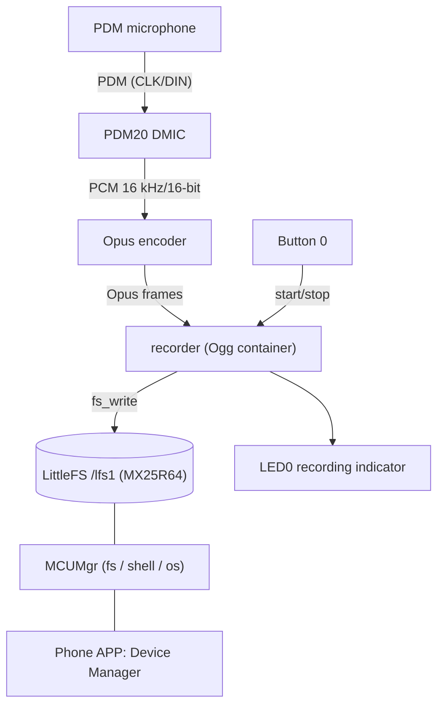
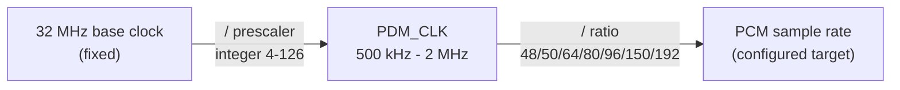

# nrf54l_pdm_opus_recorder

PDM recording and power-evaluation demo for the nRF54L15 / nRF54LM20

Environment: nRF Connect SDK v3.4.0

## Features and usage

1. Button-triggered PDM recording → real-time Opus compression → stored as `.opus` files on external SPI flash
2. `.opus` files can be downloaded to a phone over BLE via SMP (MCUMgr)

## Architecture



## Hardware

- **Boards**: nRF54L15DK (`nrf54l15dk/nrf54l15/cpuapp`) or nRF54LM20DK (`nrf54lm20dk/nrf54lm20b/cpuapp`). On-board MX25R64 (spi00 @ 32 MHz)
- **PDM digital microphones**: 2. If you only have 1, change the configuration from stereo to mono.
- PPK II: optional, for power measurement

### PDM wiring

| DK    | PDM microphone |
| ----- | -------------- |
| P1.12 | CLK            |
| P1.11 | DIN / DATA     |
| GND   | GND            |
| VDDIO | VDD            |

- Two microphones share CLK/DIN; their L/R pins are strapped to VDD and GND respectively to form stereo. With a single microphone, connect one channel only and select the matching mono configuration.

- The microphones are powered from VDDIO; their current is not part of the SoC power measurement.

- UART logging goes through the on-board J-Link USB virtual COM port.


## Getting the project

Clone this project, then load `opus` and `ogg` via git submodule:

```powershell
git submodule update --init
```

## Build and flash

Debug build:

```bash
west build -p always -b nrf54lm20dk/nrf54lm20b/cpuapp -d build .

west flash -d build
```

Release build:

```bash
west build -p always -b nrf54lm20dk/nrf54lm20b/cpuapp -d build_release . -- "-DFILE_SUFFIX=release"

west flash -d build_release
```

PDM Only build:

```bash
west build -p always -b nrf54lm20dk/nrf54lm20b/cpuapp -d build_pdm_only . -- "-DFILE_SUFFIX=pdm_only"

west flash -d build_pdm_only
```

> For the nRF54L15DK, just change the board target to `nrf54l15dk/nrf54l15/cpuapp`.

## Configuration

Sample rate choice:

- `CONFIG_PDM_DEMO_SAMPLE_RATE_8000`
- `CONFIG_PDM_DEMO_SAMPLE_RATE_12000`
- `CONFIG_PDM_DEMO_SAMPLE_RATE_16000` (default)
- `CONFIG_PDM_DEMO_SAMPLE_RATE_24000`

Channel choice:

- `CONFIG_PDM_DEMO_STEREO`: stereo (dual channel), default
- `PDM_DEMO_MONO_LEFT`: left channel
- `PDM_DEMO_MONO_RIGHT`: right channel

Audio capture and Opus compression frame duration:

- `CONFIG_PDM_DEMO_BLOCK_MS_5`
- `CONFIG_PDM_DEMO_BLOCK_MS_10`
- `CONFIG_PDM_DEMO_BLOCK_MS_20` (default)
- `CONFIG_PDM_DEMO_BLOCK_MS_40`
- `CONFIG_PDM_DEMO_BLOCK_MS_60`

Number of PDM DMA buffer blocks. Frame duration × block count = tolerable occasional audio-processing latency. This is not a Kconfig option: it is defined solely by the `queue-size` property of the `pdm20` devicetree node (`<16>` in the current overlays), and the application's memory slab is derived from it automatically — no manual syncing needed.

Opus compression complexity; higher costs more CPU:

- `CONFIG_PDM_DEMO_OPUS_COMPLEXITY`, default `0`, range `0` - `10`

Volume gain (dB):

- `CONFIG_PDM_DEMO_GAIN_DB`: default `12`, range `0` - `40`

Maximum recording length (seconds). If Button 0 is never pressed to stop manually, recording lasts at most this long:

- `CONFIG_PDM_DEMO_REC_SECONDS`: default `300`

Standalone PDM power-evaluation mode. PDM capture + Opus encoding only, no storage. For power evaluation:

- `CONFIG_PDM_DEMO_PDM_ONLY`, default `n`

## Running

1. After power-up PDM is off; only BLE advertising runs. The Debug build has logging; the Release build is low power.
2. **Press Button 0 once** to start recording: PDM capture + Opus encoding + streaming to `/lfs1/rec_XXXX.opus`, **LED0 on**; **press again** to stop and save, LED0 off. Recording stops automatically after `CONFIG_PDM_DEMO_REC_SECONDS` (default 300) seconds to prevent flash overflow. The 64 Mbit flash holds about 60 minutes of audio at most.
3. Retrieve files (BLE, device name `PDM_SMP`, no pairing):
   - **Android**: use the nRF Connect Device Manager phone app. Run `fs ls /lfs1` in the Shell tab to list all files; download by file path in the Files tab.
   - **iOS**: the Device Manager app has no Shell tab yet. First download the fixed path `/lfs1/index.txt` (refreshed at boot and after every recording, containing all file names and sizes), then download by full path. The in-app Preview does not support `.opus`; save the file to the phone and play it in a file manager.

Debug firmware prints statistics every 100 blocks on the log port (average frame bytes, max encode time, error count).

Expected log:

```text
[00:00:00.018,353] <inf> littlefs: LittleFS version 2.11, disk version 2.1
[00:00:00.019,103] <inf> littlefs: FS at mx25r6435f@0:0x0 is 2048 0x1000-byte blocks with 512 cycle
[00:00:00.019,110] <inf> littlefs: partition sizes: rd 16 ; pr 256 ; ca 512 ; la 32
*** Booting nRF Connect SDK v3.4.0-99553055607b ***
*** Using Zephyr OS v4.4.0-bf801e4e3d19 ***
[00:00:00.042,622] <inf> opus_enc: Opus encoder ready: state 43308 bytes, frame 320 samples/ch (20 ms), complexity 0
[00:00:00.183,162] <inf> recorder: /lfs1 ready: 8192 KB total, 7216 KB free
[00:00:00.977,243] <inf> bt_sdc_hci_driver: SoftDevice Controller build revision: 
                                            c8 da 30 98 f9 f0 34 a4  4b 6e ba d3 08 19 cc 0c |..0...4. Kn......
                                            ea 51 da 47                                      |.Q.G             
[00:00:00.980,434] <inf> smp_bt: SMP advertising started (name "PDM_SMP")
[00:00:00.980,726] <inf> pdm_opus_recorder: PCM gain 12 dB (x3.98)
[00:00:00.980,842] <inf> pdm_opus_recorder: nrf54lm20dk PDM Opus recorder ready
[00:00:00.980,849] <inf> pdm_opus_recorder: PDM20 CLK=P1.12 DIN=P1.11, PCM=16000 Hz/16-bit
[00:00:00.980,853] <inf> pdm_opus_recorder: Press Button 0 to start/stop recording
```

Recording:

```text
[00:00:10.608,879] <wrn> recorder: slow fs_write: 260125 us (hdr 91 body 4098)
[00:00:11.047,211] <inf> pdm_opus_recorder: Blocks 100, opus avg 64 B/frame, max enc 9210 us, err 0
[00:00:11.765,182] <wrn> recorder: slow fs_write: 159064 us (hdr 90 body 4124)
[00:00:13.022,554] <wrn> recorder: slow fs_write: 158669 us (hdr 90 body 4155)
[00:00:13.100,152] <inf> pdm_opus_recorder: Blocks 200, opus avg 65 B/frame, max enc 9210 us, err 0

...

[00:01:44.266,394] <wrn> recorder: slow fs_write: 158842 us (hdr 89 body 4107)
[00:01:44.846,139] <inf> pdm_opus_recorder: Blocks 4800, opus avg 66 B/frame, max enc 9732 us, err 0
[00:01:45.531,417] <wrn> recorder: slow fs_write: 166560 us (hdr 90 body 4100)
[00:01:45.531,492] <inf> pdm_capture: PDM capture stopped
[00:01:45.535,986] <inf> recorder: Saved /lfs1/rec_0024.opus, 329282 bytes
```


## Power measurement

Release builds use a standalone base configuration `prj_release.conf`. UART logging is disabled; all other features are kept.

The PDM Only build keeps only button-triggered PDM capture + Opus encoding. No storage, no BLE transfer, no logging, no LED indication.

Measurement procedure:

1. Set up the DK SoC current-measurement path and the PPK2 according to the DK hardware guide.
2. Flash the corresponding firmware and cold-boot with the power switch.
3. After startup transients settle, the idle-state current can be evaluated.
4. Press Button 0 to evaluate the current during recording.

### Power data

Release firmware: IDLE state, 300 ms BLE advertising. Average 27 uA, floor current 3.7 uA.


Release firmware: stereo PDM capture + Opus encoding + external SPI flash storage. 1.56 mA. Microphones not included.


PDM Only firmware: PDM capture + Opus encoding. Average 1.42 mA.


Zoomed-in view. For a 20 ms stereo frame, Opus encoding takes about 8 ms.


With PDM capture (800 kHz, stereo) enabled, the floor current is 347 uA:


## Notes

### Manually disabling the PDM pins

The NCS PDM driver does not support PM Device yet. The application must control pinctrl manually: when not recording, apply the sleep-state pin configuration (disconnected). Otherwise the DATA pin leaks current.

```dts
&pinctrl {
	pdm20_default_pdm_demo: pdm20_default_pdm_demo {
		group1 {
			psels = <NRF_PSEL(PDM_CLK, 1, 12)>,
				<NRF_PSEL(PDM_DIN, 1, 11)>;
			nordic,drive-mode = <NRF_DRIVE_H0H1>;
		};
	};

	pdm20_sleep_pdm_demo: pdm20_sleep_pdm_demo {
		group1 {
			psels = <NRF_PSEL(PDM_CLK, 1, 12)>,
				<NRF_PSEL(PDM_DIN, 1, 11)>;
			low-power-enable;
		};
	};
};
```

```c
pinctrl_apply_state(pdm_pcfg, PINCTRL_STATE_SLEEP);
```

### Opus performance

Opus and Ogg are loaded as external modules. Opus needs extra ARM optimization options when loaded:

```cmake
# OPUS_ARM_INLINE_*: Cortex-M33 (ARMv8-M Mainline DSP) supports the ARMv5E
# instructions (SMULBB/SMLAWB/...), enabling opus's header-only inline-asm
# fast paths. No NEON on M33, so the *_neon_intr sources stay excluded.
zephyr_library_compile_definitions(
  FIXED_POINT
  OPUS_ARM_INLINE_ASM
  OPUS_ARM_INLINE_EDSP
)
```

The current CPU performance cannot support floating-point Opus, so fixed-point arithmetic is used.

### Sample rate constraints

The PDM clock is derived from the configured sample rate. The driver iterates over the hardware decimation ratios (48/50/64/80/96/150/192) and tries integer division for each:

```
PDM_CLK = 32 MHz / prescaler    (prescaler is an integer, 4-126)
PCM rate = PDM_CLK / ratio
```



Both ends are fixed: the chip's 32 MHz base clock on the left, your target sample rate on the right; PDM_CLK in the middle is dialed in by the two integer coefficients, prescaler and ratio. The driver picks the combination with the smallest error inside the overlay's clock window (500 kHz - 2 MHz).

Because the prescaler must be an integer, only 8 kHz (32 MHz / 50 = 640 kHz, / ratio 80) and 16 kHz (32 MHz / 40 = 800 kHz, / ratio 50) get an exact clock; 12/24/48 kHz have no integer solution, so the actual rate is off by ~0.8% (e.g. 24 kHz runs at 23810 Hz) — a barely audible pitch shift on playback.

Worth noting: the search iterates ratios in ascending order and stops at the first zero-error combination, so when several exact solutions exist, the winner is always the one with the smallest ratio and lowest PDM_CLK (e.g. 16 kHz gets 800 kHz, not 1.28 MHz / ratio 80) — good for power and GPIO edge rates. This is just a side effect of the search order, not a deliberate low-power design; when no exact solution exists (12/24 kHz), all ratios are evaluated and the lowest-error one wins, which is not necessarily the lowest clock.

48 kHz additionally exceeds the CPU budget (encoding takes longer than a frame), so Kconfig simply doesn't offer it. Note that 24 kHz stereo uses ~70% CPU for encoding — marginal; a build-time check in `opus_enc.c` rejects any combination whose encode estimate exceeds 75% of the frame period.

### Flash write time and the PDM buffer

SPI must be configured to 32 MHz.

Also, since `CONFIG_PM_DEVICE_RUNTIME` is enabled, SPI / flash are automatically disabled when idle. During continuous recording they must be explicitly kept awake:

```c
/* Pin flash + SPI bus active for the whole clip. */
(void)pm_device_runtime_get(rec_flash);
(void)pm_device_runtime_get(rec_spi);
```

Release the reference counts after recording finishes:

```c
(void)pm_device_runtime_put(rec_spi);
(void)pm_device_runtime_put(rec_flash);
```

Even with the above optimizations in place, flash writes still occasionally stall:

```text
[00:00:10.608,879] <wrn> recorder: slow fs_write: 260125 us (hdr 91 body 4098)
[00:00:11.047,211] <inf> pdm_opus_recorder: Blocks 100, opus avg 64 B/frame, max enc 9210 us, err 0
[00:00:11.765,182] <wrn> recorder: slow fs_write: 159064 us (hdr 90 body 4124)
[00:00:13.022,554] <wrn> recorder: slow fs_write: 158669 us (hdr 90 body 4155)
[00:00:13.100,152] <inf> pdm_opus_recorder: Blocks 200, opus avg 65 B/frame, max enc 9210 us, err 0
[00:00:14.267,893] <wrn> recorder: slow fs_write: 166591 us (hdr 89 body 4152)
[00:00:15.039,151] <inf> pdm_opus_recorder: Blocks 300, opus avg 65 B/frame, max enc 9210 us, err 0
[00:00:15.498,001] <wrn> recorder: slow fs_write: 159147 us (hdr 89 body 4115)
[00:00:16.735,604] <wrn> recorder: slow fs_write: 159427 us (hdr 89 body 4162)
```

This is related to filesystem behavior. The longest slow write is basically the first frame, about 260 ms. The PDM capture DMA buffer must cover this time; the current configuration is `CONFIG_PDM_DEMO_BLOCK_COUNT=16`, and 16 × 20 ms = 320 ms is enough.

`CONFIG_PDM_DEMO_BLOCK_COUNT` must match `queue-size = <16>` in the devicetree.

### Volume gain

The volume gain is applied before Opus, using fixed-point multiplication.

```c
/* Fixed-point Q16 multiply with int16 saturation. Gain must live before
 * compression: Opus packets cannot be scaled linearly.
 * The product is computed in int64: with int32 the multiply can overflow
 * (signed overflow is UB), which lets the compiler legally optimize the
 * CLAMP away entirely - loud signals then wrap around instead of
 * saturating. */
static void apply_gain(int16_t *samples, size_t size)
{
	for (size_t i = 0; i < size / sizeof(*samples); i++) {
		int32_t s = (int32_t)(((int64_t)samples[i] * gain_q16 +
				       0x8000) >> 16);

		samples[i] = (int16_t)CLAMP(s, INT16_MIN, INT16_MAX);
	}
}
```

1. When multiplying, the code first widens the sample to a 64-bit integer (`int64_t`) to prevent arithmetic overflow.
2. `+ 0x8000` corresponds to the fixed-point value `0.5`, so the conversion back to integer **rounds** instead of truncating.
3. If the amplified value `s` exceeds the maximum (32767) or minimum (-32768) representable by a signed 16-bit integer, the `CLAMP` macro forces it to **saturate** at the limit, preventing audio **wrap-around**.

### MCUMgr file access hook

The build prints a CMake warning: fs_mgmt is enabled but file access hooks (`CONFIG_MCUMGR_GRP_FS_FILE_ACCESS_HOOK`) are not. This is an access-control mechanism, not a feature switch — phone upload/download works fine without it.

When enabled, fs_mgmt asks the application via `mgmt_callback_notify(MGMT_EVT_OP_FS_MGMT_FILE_ACCESS, ...)` before every file operation (download/upload/status/hash); the callback can allow, deny, or rewrite the path based on the path and access type (READ/WRITE).

This demo intentionally leaves hooks off with unpaired BLE advertising: any device in range can read/write any file under `/lfs1`. For production, enable hooks with a whitelist (e.g. allow only reads of `/lfs1/rec_*.opus`, deny all writes) — or more fundamentally, add pairing/encryption to the SMP transport.
