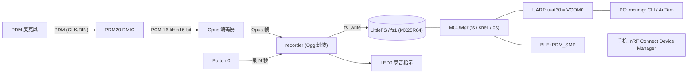

# nrf54l_pdm_opus_recorder

nRF54L15 / nRF54LM20 上的 PDM 录音与功耗评估 Demo（Zephyr DMIC API，
NCS v3.4.0）。

## 1. 功能与操作

持续 PDM 录音 → 实时 Opus 压缩 → 按键把最近一段音频落盘为 `.opus`
文件（外部 flash 上的 LittleFS，LED 指示录音状态）→ 通过 SMP 协议
（MCUMgr）经串口或 BLE 把文件传到 PC 或手机。



### 操作

1. 上电后自动开始持续采集和编码，不占 flash。
2. **按一下 Button 0**：把接下来的 `CONFIG_PDM_DEMO_REC_SECONDS`
   （默认 10）秒音频写成 `/lfs1/rec_XXXX.opus`；录音期间 **LED0 亮**，
   保存后熄灭。录音中再按无效。
3. 取文件：
   - **PC 串口**：MCUMgr 在 VCOM0（Windows 上通常是第一个 COM 口，
     115200 8N1）；日志在 VCOM1（第二个 COM 口）。

     ```powershell
     mcumgr --conntype serial --connstring dev=COM3,baud=115200 shell exec fs ls /lfs1
     mcumgr --conntype serial --connstring dev=COM3,baud=115200 fs download /lfs1/rec_0000.opus rec_0000.opus
     ```

   - **手机 BLE**：连接名为 `PDM_SMP` 的设备（无配对）。Android 版
     nRF Connect Device Manager 有 Shell 页，可直接 `fs ls /lfs1`。
   - **iOS**：Device Manager 无 Shell 页且 SMP 没有列目录命令，先下载
     固定路径 `/lfs1/index.txt`（启动和每次录音后自动刷新，含全部
     文件名和大小），再按完整路径下载。App 内 Preview 不支持 `.opus`，
     下载后用 VLC 等播放器打开。

Debug 固件每 100 个 block 在日志口输出一次统计（平均帧长、最大编码
耗时、错误数）。

## 2. 硬件

- **开发板**：nRF54L15DK（`nrf54l15dk/nrf54l15/cpuapp`）或
  nRF54LM20DK（`nrf54lm20dk/nrf54lm20b/cpuapp`），`boards/` 下均有
  现成配置
- **NCS**：v3.4.0
- **PDM 外设**：PDM20，ratio 50，PDM clock 800 kHz，引脚驱动 `H0H1`
- **外部 flash**：板上 MX25R64（spi00 @ 32 MHz），整片 8 MB 挂
  LittleFS 到 `/lfs1`
- **串口**：VCOM0 = uart30 = MCUMgr；VCOM1 = uart20 = 日志

### PDM 接线

| DK | PDM 麦克风 |
|---|---|
| P1.12 | CLK |
| P1.11 | DIN / DATA |
| GND | GND |
| 外部供电 | VDD |

双麦克风共用 CLK/DIN，各自 L/R 脚固定为 left/right 组成立体声；
单麦克风只接一个声道并选对应 mono 配置。P1.11/P1.12 不要和
nRF7002 shield 同用。麦克风由外部供电，其电流不计入 SoC 功耗。

## 3. Clone 与编译

Opus 编解码器是 git submodule（`lib/opus`，xiph/opus v1.5.2），
clone 后先初始化：

```powershell
git submodule update --init
```

升级 Opus：`cd lib/opus; git fetch --tags; git checkout v1.x.y`，
然后 `git add lib/opus` 提交新指针。Zephyr module 胶水层在
`modules/opus/`，上游小版本升级一般无需改动。

### Debug 构建（默认 stereo + Opus + MCUMgr）

```powershell
nrfutil sdk-manager toolchain env --ncs-version=v3.4.0 --as-script powershell | Out-String | Invoke-Expression
$env:ZEPHYR_BASE = (Resolve-Path "D:\ncs\v3.4.0\zephyr").Path

west build -p always -b nrf54lm20dk/nrf54lm20b/cpuapp -d build . --no-sysbuild
west flash -d build
```

nRF54L15DK 把 board target 换成 `nrf54l15dk/nrf54l15/cpuapp` 即可。

构建后检查产物：`build/zephyr/zephyr.hex`、`zephyr.dts`、`.config`。

## 4. Release 与功耗测量

Release 构建使用独立的基础配置 `prj_release.conf`（通过
`-DFILE_SUFFIX=release` 完整替换 `prj.conf`，不是叠加），关闭日志、
串口和 console，行为：**持续 PDM 录音 + Opus 压缩 + 按键落盘 + SMP
over BLE**（串口 SMP 随串口一起关闭，BLE 传输和录音功能不受影响）。
用于功耗测量。

```powershell
# Release stereo（默认）
west build -p always -b nrf54lm20dk/nrf54lm20b/cpuapp -d build_release . --no-sysbuild `
    -- "-DFILE_SUFFIX=release"

# Release mono（left；right 用 -DCONFIG_PDM_DEMO_MONO_RIGHT=y）
west build -p always -b nrf54lm20dk/nrf54lm20b/cpuapp -d build_release_mono . --no-sysbuild `
    -- "-DFILE_SUFFIX=release" "-DCONFIG_PDM_DEMO_MONO_LEFT=y"

# 纯 PDM 功耗基线（独立基础配置 prj_test_only.conf：不编码、不落盘、无 SMP/BLE）
west build -p always -b nrf54lm20dk/nrf54lm20b/cpuapp -d build_test_only . --no-sysbuild `
    -- "-DFILE_SUFFIX=test_only"
```

测量方法：

1. 按 DK 硬件指南接好 SoC 电流测量路径和 PPK2。
2. 烧录对应固件并复位，PDM 自动开始持续录音。
3. 等启动瞬态结束后记录平均电流。
4. 对比测试时保持声道数、PDM 时钟、block 时长和供电电压一致。

Runtime PM 默认开启（`CONFIG_PM_DEVICE_RUNTIME`），空闲外设自动挂起；
录音期间固件通过 `pm_device_runtime_get()` 按住 flash 和 SPI 总线，
避免每次写操作支付唤醒开销。

### 功耗数据


<!-- TODO: 补充更多功耗测量图 -->

## 5. 重要配置

音频参数（Kconfig，`west build -t menuconfig` 或直接改默认值）：

- `CONFIG_PDM_DEMO_SAMPLE_RATE`（默认 16000）：choice 只提供 Opus 合法
  的 8/12/16/24/48 kHz；改动时确认 overlay 里 PDM 时钟范围能整除。
- `CONFIG_PDM_DEMO_STEREO` / `MONO_LEFT` / `MONO_RIGHT`：声道三选一。
- `CONFIG_PDM_DEMO_BLOCK_MS`（默认 20）：DMA block 时长 = Opus 帧长，
  choice 只允许 5/10/20/40/60 ms。
- `CONFIG_PDM_DEMO_BLOCK_COUNT`（默认 16，range 4-16）：DMA slab 块数。
  16 × 20 ms = 320 ms 缓冲，专门覆盖录音时 LittleFS 现场擦除 flash
  block 的耗时（MX25R64 4KB 擦除 max ~300 ms）；缓冲不足时 PDM 驱动
  会因分配不到 buffer 而永久停采（固件检测到持续超时后会自动重启
  采集）。overlay 里 `queue-size = <16>` 与之对应。
- `CONFIG_PDM_DEMO_OPUS_COMPLEXITY`（默认 0）：越大越慢；定点 +
  EDSP、complexity 0 稳态约 4.7 ms/帧（~23% CPU @ 128 MHz M33）。
  只保留定点构建（float 即使 complexity 0 也要 ~31 ms/帧，无法实时）。
- `CONFIG_PDM_DEMO_GAIN_DB`（默认 0，0-40 dB）：编码前对 PCM 施加的
  数字增益（定点 Q16 乘法 + int16 饱和）。6 dB ≈ 幅值翻倍；过大响度
  会削顶。增益必须在压缩前加——Opus 码流不能线性缩放，压缩后调节
  只能解码→增益→重编码。`PDM_TEST_ONLY` 构建忽略此项。
- `CONFIG_PDM_DEMO_REC_SECONDS`（默认 10）：每次按键的录音时长。
- `CONFIG_PDM_TEST_ONLY`（默认 n）：纯 PDM 功耗基线开关，读出即丢弃。
  实际构建用 `prj_test_only.conf`（内含该开关并额外关掉 flash/SMP/BLE），
  见第 4 节。

软件结构：各模块通过 `SYS_INIT` 自初始化（APPLICATION 级，优先级
`opus_enc` 50 → `recorder` 60（LittleFS automount 在 POST_KERNEL 已完成）
→ `smp_bt` 70 → button/LED 80），`main()` 只负责启动采集和主循环。
`recorder.c` 仅在 `CONFIG_FILE_SYSTEM=y`、`smp_bt.c` 仅在 `CONFIG_BT=y`
时编译。

其他关键项：

- Heap / main stack 通过 Kconfig 默认设为 128 KB / 64 KB（Opus 需要）。
- overlay 中 `clk-frequency-min/max = 795000/805000` 排除 ratio 48，
  强制 800 kHz / ratio 50，PCM 精确 16 kHz。
- 外部 flash SPI 时钟 32 MHz（SPIM00 上限 128 MHz/4）。
- MCUMgr：fs / os / shell 组全开；UART（uart30）+ BLE（`PDM_SMP`，
  无配对）双传输；`CONFIG_SYSTEM_WORKQUEUE_STACK_SIZE=2304` 是 fs
  上传的最低要求。
