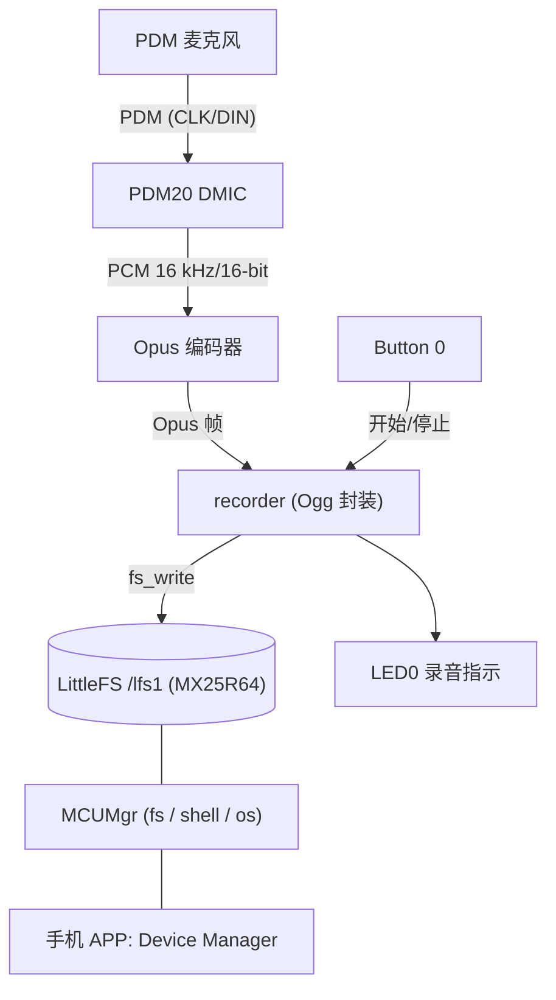
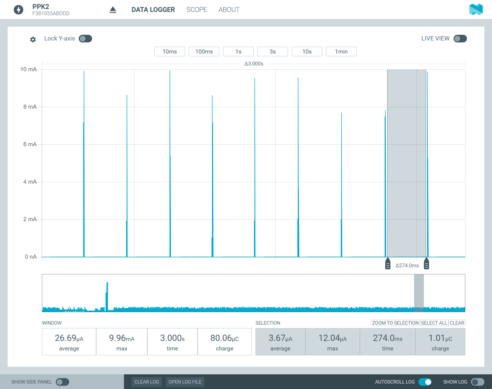
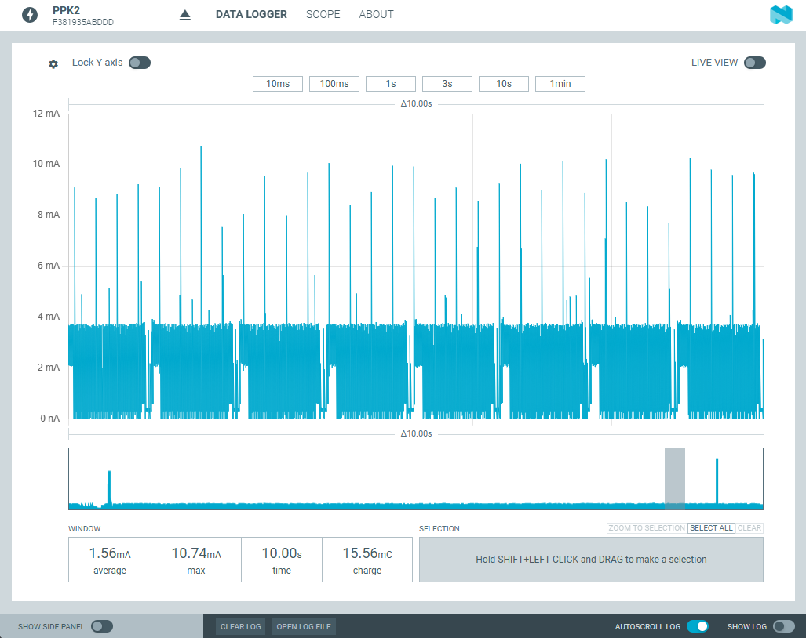
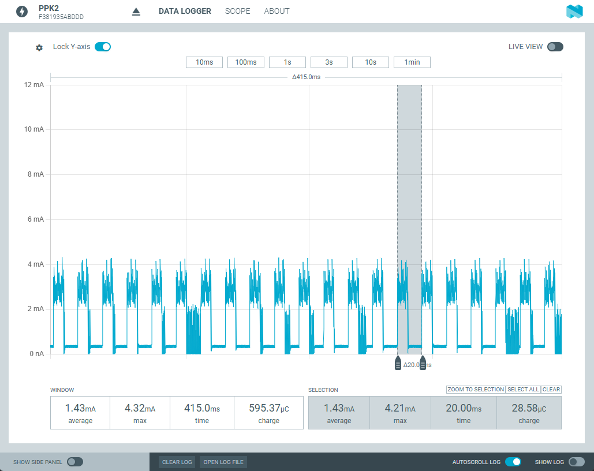
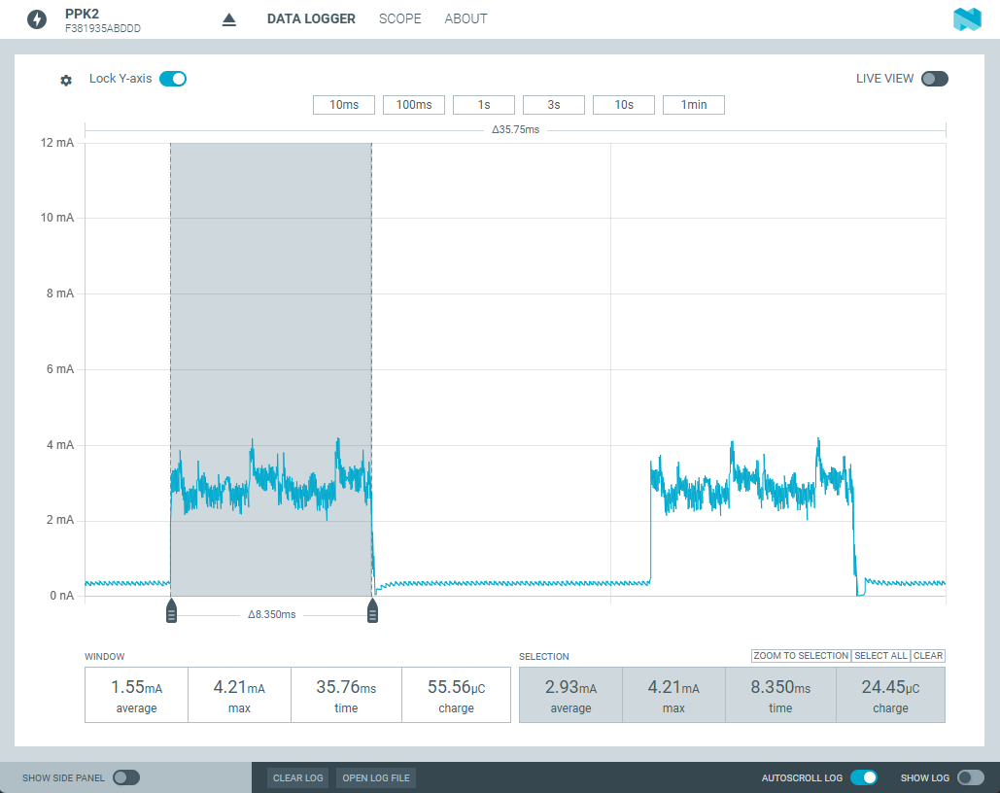
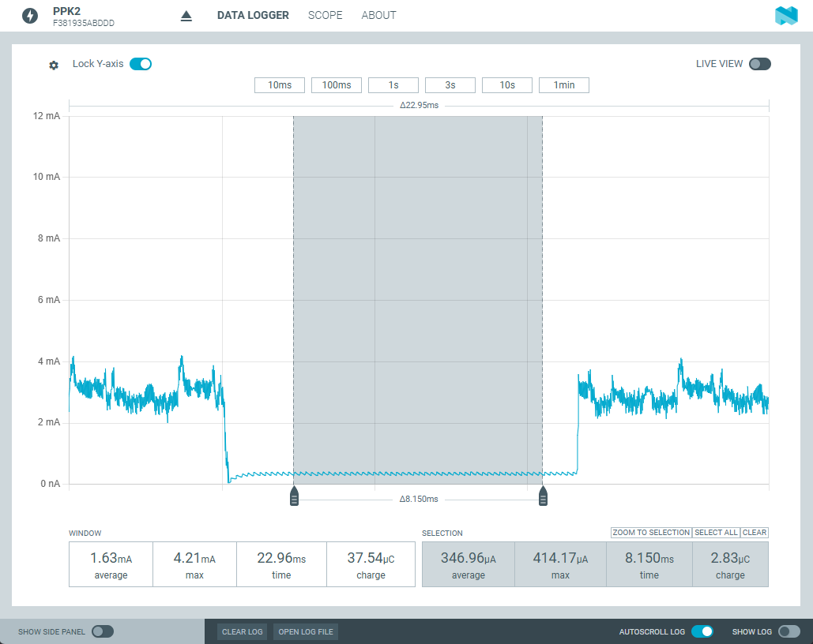
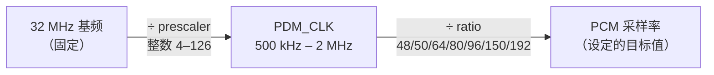

# nrf54l_pdm_opus_recorder

nRF54L15 / nRF54LM20 上的 PDM 录音与功耗评估 Demo

环境：nRF Connect SDK v3.4.0

## 功能与操作

1. 按键触发PDM 录音 → 实时 Opus 压缩 → 在外部 SPI Flash存储为 `.opus`文件
2. 可通过 SMP（MCUMgr），在手机上用 BLE 下载`.opus`文件

## 架构



## 硬件

- **开发板**：nRF54L15DK（`nrf54l15dk/nrf54l15/cpuapp`）或 nRF54LM20DK（`nrf54lm20dk/nrf54lm20b/cpuapp`）。板载 MX25R64（spi00 @ 32 MHz）
- **PDM 数字麦克风**：2个。如果只有1个需改配置将立体声改为单声道。
- PPK Ⅱ：可选，功耗测量

### PDM 接线

| DK    | PDM 麦克风 |
| ----- | ---------- |
| P1.12 | CLK        |
| P1.11 | DIN / DATA |
| GND   | GND        |
| VDDIO | VDD        |

- 双麦克风共用 CLK/DIN，各自 L/R 脚分别接 VDD 和 GND 组成立体声；单麦克风只接一个声道并选对应 mono 配置。

- 麦克风由 VDDIO 供电，其电流不计入 SoC 功耗。

- 串口日志由板载 J-Link USB虚拟串口接入


## 获取项目

clone 本项目。然后通过 git submodule 加载 `opus`和`ogg`。

```powershell
git submodule update --init
```

## 构建与烧录

Debug 构建：

```bash
west build -p always -b nrf54lm20dk/nrf54lm20b/cpuapp -d build .

west flash -d build
```

Release 构建：

```bash
west build -p always -b nrf54lm20dk/nrf54lm20b/cpuapp -d build_release . -- "-DFILE_SUFFIX=release"

west flash -d build_release
```

PDM Only 构建：

```bash
west build -p always -b nrf54lm20dk/nrf54lm20b/cpuapp -d build_pdm_only . -- "-DFILE_SUFFIX=pdm_only"

west flash -d build_pdm_only
```

>  nRF54L15DK 把 board target 换成 `nrf54l15dk/nrf54l15/cpuapp` 即可。

## 配置

采样率选择：

- `CONFIG_PDM_DEMO_SAMPLE_RATE_8000`
- `CONFIG_PDM_DEMO_SAMPLE_RATE_12000`
- `CONFIG_PDM_DEMO_SAMPLE_RATE_16000`，是默认选项
- `CONFIG_PDM_DEMO_SAMPLE_RATE_24000`

声道选择：

- `CONFIG_PDM_DEMO_STEREO`：立体声（双声道），是默认选项
- `PDM_DEMO_MONO_LEFT`：左声道
- `PDM_DEMO_MONO_RIGHT`：右声道

音频采样与 Opus 压缩帧时长：

- `CONFIG_PDM_DEMO_BLOCK_MS_5`
- `CONFIG_PDM_DEMO_BLOCK_MS_10`
- `CONFIG_PDM_DEMO_BLOCK_MS_20`，是默认选项
- `CONFIG_PDM_DEMO_BLOCK_MS_40`
- `CONFIG_PDM_DEMO_BLOCK_MS_60`

PDM DMA缓存帧数量。帧时长 × 帧数量 = 可容许的偶发音频处理延迟。该值不在 Kconfig 中，由设备树 `pdm20` 节点的 `queue-size` 属性唯一定义（当前 overlay 为 `<16>`），应用侧的内存池直接从设备树派生，无需手动保持一致。

OPUS 压缩复杂度，更高则更占 CPU 性能：

- `CONFIG_PDM_DEMO_OPUS_COMPLEXITY`，默认值`0`，范围 `0` - `10`

音量增益（dB）：

- `CONFIG_PDM_DEMO_GAIN_DB`：默认值`12`，范围`0`-`40`

最大录制时长（秒）。录制状态，一直不按下 button 0 手动结束，则最大持续到此时间：

- `CONFIG_PDM_DEMO_REC_SECONDS`：默认值`300`

PDM功耗单独评估模式。只有 PDM 录制和 OPUS编码，不存储。用于功耗评估。：

- `CONFIG_PDM_DEMO_PDM_ONLY`，默认`n`

## 运行

1. 上电后 PDM 关闭，只有 BLE 广播。Debug 版本有日志，Release 版本低功耗。
2. **按一下 Button 0** 开始录音：PDM 采集 + Opus 编码 + 实时写入`/lfs1/rec_XXXX.opus`，**LED0 亮**；**再按一下**停止并保存，LED0 灭。最长录音 `CONFIG_PDM_DEMO_REC_SECONDS`（默认 300）秒后自动停止，防止 flash 溢出。64M Bits Flash 最多录制约60分钟。
3. 取文件（BLE，蓝牙设备名 `PDM_SMP`，无配对）：
   - **Android**：使用 nRF Connect Device Manager 手机 APP。在 Shell 页执行`fs ls /lfs1` 命令查看所有文件；在 Files 页按文件路径名下载。
   - **iOS**：Device Manager APP 暂无 Shell 页。先下载固定路径 `/lfs1/index.txt`（启动和每次录音后自动刷新，含全部文件名和大小），再按完整路径下载。App 内 Preview 不支持 `.opus`，下载后保存到手机在文件管理器中可播放。

Debug 固件每 100 个 block 在日志口输出一次统计（平均帧长、最大编码耗时、错误数）。

预期日志：

```text
[00:00:00.018,353] <inf> littlefs: LittleFS version 2.11, disk version 2.1
[00:00:00.019,103] <inf> littlefs: FS at mx25r6435f@0:0x0 is 2048 0x1000-byte blocks with 512 cycle
[00:00:00.019,110] <inf> littlefs: partition sizes: rd 16 ; pr 256 ; ca 512 ; la 32
*** Booting nRF Connect SDK v3.4.0-99553055607b ***
*** Using Zephyr OS v4.4.0-bf801e4e3d19 ***
[00:00:00.042,622] <inf> opus_enc: Opus encoder ready: state 43308 bytes, frame 320 samples/ch (20 ms), complexity 0
[00:00:00.183,162] <inf> recorder: /lfs1 ready: 8192 KB total, 7216 KB free
[00:00:00.977,243] <inf> bt_sdc_hci_driver: SoftDevice Controller build revision: 
                                            c8 da 30 98 f9 f0 34 a4  4b 6e ba d3 08 19 cc 0c |..0...4. Kn......
                                            ea 51 da 47                                      |.Q.G             
[00:00:00.980,434] <inf> smp_bt: SMP advertising started (name "PDM_SMP")
[00:00:00.980,726] <inf> pdm_opus_recorder: PCM gain 12 dB (x3.98)
[00:00:00.980,842] <inf> pdm_opus_recorder: nrf54lm20dk PDM Opus recorder ready
[00:00:00.980,849] <inf> pdm_opus_recorder: PDM20 CLK=P1.12 DIN=P1.11, PCM=16000 Hz/16-bit
[00:00:00.980,853] <inf> pdm_opus_recorder: Press Button 0 to start/stop recording
```

录制：

```text
[00:00:10.608,879] <wrn> recorder: slow fs_write: 260125 us (hdr 91 body 4098)
[00:00:11.047,211] <inf> pdm_opus_recorder: Blocks 100, opus avg 64 B/frame, max enc 9210 us, err 0
[00:00:11.765,182] <wrn> recorder: slow fs_write: 159064 us (hdr 90 body 4124)
[00:00:13.022,554] <wrn> recorder: slow fs_write: 158669 us (hdr 90 body 4155)
[00:00:13.100,152] <inf> pdm_opus_recorder: Blocks 200, opus avg 65 B/frame, max enc 9210 us, err 0

...

[00:01:44.266,394] <wrn> recorder: slow fs_write: 158842 us (hdr 89 body 4107)
[00:01:44.846,139] <inf> pdm_opus_recorder: Blocks 4800, opus avg 66 B/frame, max enc 9732 us, err 0
[00:01:45.531,417] <wrn> recorder: slow fs_write: 166560 us (hdr 90 body 4100)
[00:01:45.531,492] <inf> pdm_capture: PDM capture stopped
[00:01:45.535,986] <inf> recorder: Saved /lfs1/rec_0024.opus, 329282 bytes
```


## 功耗测量

Release 构建使用独立的基础配置 `prj_release.conf`。关闭串口日志，保留其他功能。

PDM Only 构建只保留按键启用 PDM 录制 + Opus 编码。无落盘、BLE传输和日志、LED指示。

测量方法：

1. 按 DK 硬件指南接好 SoC 电流测量路径和 PPK2。
2. 烧录对应固件，并用开关重新上电冷启动。
3. 等启动瞬态结束后可评估空闲状态电流
4. 按下 button 0 可评估录音期间电流。

### 功耗数据

Release 固件：IDLE 状态， 300ms 蓝牙广播。平均 27 uA，底电流 3.7 uA。




Release 固件：双声道 PDM 捕获 + Opus 编码 + 外部 SPI Flash 存储。1.56 mA。不含麦克风本身。



PDM Only 固件：PDM捕获 + Opus 编码。平均 1.42 mA。



放大查看。20 ms 立体声帧， OPUS 编码约耗时 8ms。



PDM 捕获（800kHz，双声道）开启时，底电流 347 uA：



## 注意事项

### PDM 引脚手动关闭

NCS PDM Driver 暂不支持 PM Device。因此程序中需手动控制 pinctrl，不录音时用 sleep 状态的引脚配置（disconnect 状态）。否则 DATA 脚会有漏电流。

```dts
&pinctrl {
	pdm20_default_pdm_demo: pdm20_default_pdm_demo {
		group1 {
			psels = <NRF_PSEL(PDM_CLK, 1, 12)>,
				<NRF_PSEL(PDM_DIN, 1, 11)>;
			nordic,drive-mode = <NRF_DRIVE_H0H1>;
		};
	};

	pdm20_sleep_pdm_demo: pdm20_sleep_pdm_demo {
		group1 {
			psels = <NRF_PSEL(PDM_CLK, 1, 12)>,
				<NRF_PSEL(PDM_DIN, 1, 11)>;
			low-power-enable;
		};
	};
};
```

```c
pinctrl_apply_state(pdm_pcfg, PINCTRL_STATE_SLEEP);
```

### OPUS 性能

OPUS 和 OGG 是以 external module 的方式载入。其中 OPUS 载入时需要增加 ARM 优化选项：

```cmake
# OPUS_ARM_INLINE_*: Cortex-M33 (ARMv8-M Mainline DSP) supports the ARMv5E
# instructions (SMULBB/SMLAWB/...), enabling opus's header-only inline-asm
# fast paths. No NEON on M33, so the *_neon_intr sources stay excluded.
zephyr_library_compile_definitions(
  FIXED_POINT
  OPUS_ARM_INLINE_ASM
  OPUS_ARM_INLINE_EDSP
)
```

目前的 CPU 性能无法支持浮点 OPUS，使用定点计算。

### 采样率约束

PDM 时钟由设定的采样率反推而来。驱动遍历硬件支持的抽取比 ratio（48/50/64/80/96/150/192），对每个 ratio 尝试整数分频：

```
PDM_CLK = 32 MHz ÷ prescaler    （prescaler 为 4–126 的整数）
PCM 采样率 = PDM_CLK ÷ ratio
```



两端都是固定的：左边是芯片的 32 MHz 基频，右边是你要的采样率；中间的 PDM_CLK 由 prescaler 和 ratio 两个整数系数凑出来。驱动在 overlay 的时钟窗口（500 kHz – 2 MHz）内取误差最小的组合。

因为 prescaler 必须是整数，只有 8 kHz（32 MHz ÷ 50 = 640 kHz，÷ ratio 80）和 16 kHz（32 MHz ÷ 40 = 800 kHz，÷ ratio 50）能得到精确时钟；12/24/48 kHz 都没有整数解，实际采样率偏差约 ±0.8%（如 24 kHz 实际为 23810 Hz），播放时有几乎听不出的音调偏移。

值得一提的是，遍历按 ratio 升序进行、遇到误差为 0 的组合即停止，因此存在多个精确解时，选中的总是 ratio 最小、PDM_CLK 最低的那组（如 16 kHz 选中 800 kHz，而不是 1.28 MHz ÷ ratio 80），对功耗和 GPIO 边沿压力都有利。不过这只是遍历顺序带来的副作用，并非有意的低功耗设计；没有精确解时（12/24 kHz）会遍历全部 ratio 选误差最小的组合，时钟不一定最低。

48 kHz 除了时钟凑不准，CPU 也跑不动（编码耗时超过帧长），Kconfig 里直接没有这个选项。另外 24 kHz 立体声编码约占 70% CPU，比较勉强；`opus_enc.c` 的编译期检查会拦下编码估算超过帧长 75% 的组合。

### 落盘时间与 PDM Buffer

SPI 需配置为 32MHz。

此外，由于开启了`CONFIG_PM_DEVICE_RUNTIME`，SPI / Flash 不使用时会自动 disable。在连续录制期间需显式保持 SPI 和 Flash 不休眠：

```c
/* Pin flash + SPI bus active for the whole clip. */
(void)pm_device_runtime_get(rec_flash);
(void)pm_device_runtime_get(rec_spi);
```

录制完毕后再释放引用计数器：

```c
(void)pm_device_runtime_put(rec_spi);
(void)pm_device_runtime_put(rec_flash);
```

在已经完成以上优化的情况下。Flash 写入仍会有偶发的慢速写入：

```text
[00:00:10.608,879] <wrn> recorder: slow fs_write: 260125 us (hdr 91 body 4098)
[00:00:11.047,211] <inf> pdm_opus_recorder: Blocks 100, opus avg 64 B/frame, max enc 9210 us, err 0
[00:00:11.765,182] <wrn> recorder: slow fs_write: 159064 us (hdr 90 body 4124)
[00:00:13.022,554] <wrn> recorder: slow fs_write: 158669 us (hdr 90 body 4155)
[00:00:13.100,152] <inf> pdm_opus_recorder: Blocks 200, opus avg 65 B/frame, max enc 9210 us, err 0
[00:00:14.267,893] <wrn> recorder: slow fs_write: 166591 us (hdr 89 body 4152)
[00:00:15.039,151] <inf> pdm_opus_recorder: Blocks 300, opus avg 65 B/frame, max enc 9210 us, err 0
[00:00:15.498,001] <wrn> recorder: slow fs_write: 159147 us (hdr 89 body 4115)
[00:00:16.735,604] <wrn> recorder: slow fs_write: 159427 us (hdr 89 body 4162)
```

这个与文件系统行为有关。其最长的慢速写入基本上是首帧，约 260ms。PDM 捕获的 DMA buffer 必须覆盖这个时间，目前设备树配置 `queue-size = <16>`，16 × 20ms = 320 ms 足够覆盖。调整缓冲深度只需修改 overlay 中的 `queue-size`，应用的内存池会自动跟随。

### 音量增益

音量增益在 OPUS 之前完成。使用定点数乘法。

```c
/* Fixed-point Q16 multiply with int16 saturation. Gain must live before
 * compression: Opus packets cannot be scaled linearly.
 * The product is computed in int64: with int32 the multiply can overflow
 * (signed overflow is UB), which lets the compiler legally optimize the
 * CLAMP away entirely - loud signals then wrap around instead of
 * saturating. */
static void apply_gain(int16_t *samples, size_t size)
{
	for (size_t i = 0; i < size / sizeof(*samples); i++) {
		int32_t s = (int32_t)(((int64_t)samples[i] * gain_q16 +
				       0x8000) >> 16);

		samples[i] = (int16_t)CLAMP(s, INT16_MIN, INT16_MAX);
	}
}
```

1. 在相乘时，代码先将样本临时转换为 64 位整数（`int64_t`），防止算术溢出。
2. ` + 0x8000` 对应定点数 `0.5`，这是为了在接下来转回整数时进行**四舍五入**，而不是直接截断。
3. 如果音量放大后，计算出来的数值 `s` 超过了 16 位有符号整数能表示的最大值（32767）或最小值（-32768），`CLAMP` 宏就会强制将它**截断（饱和处理）**在最大值或最小值。防止音频发生**回绕（Wrap-around）**。

### MCUMgr 文件访问 hook

构建时有一条 CMake 警告：fs_mgmt 开启了但文件访问 hook（`CONFIG_MCUMGR_GRP_FS_FILE_ACCESS_HOOK`）未启用。这是权限拦截机制，不是功能开关——不开它，手机端的上传/下载功能完全正常。

开启后，每次文件操作（下载/上传/查状态/算 hash）前，fs_mgmt 会通过 `mgmt_callback_notify(MGMT_EVT_OP_FS_MGMT_FILE_ACCESS, ...)` 回调应用，应用可按路径和操作类型（READ/WRITE）放行、拒绝或改写路径。

本工程是 Demo，BLE 无配对广播，故意不开 hook：任何能连上的设备都能读写 `/lfs1` 下任意文件。产品化时建议开启并配白名单（例如只放行 `/lfs1/rec_*.opus` 的读取、拒绝一切写入），更根本的做法是给 SMP 加配对加密。
